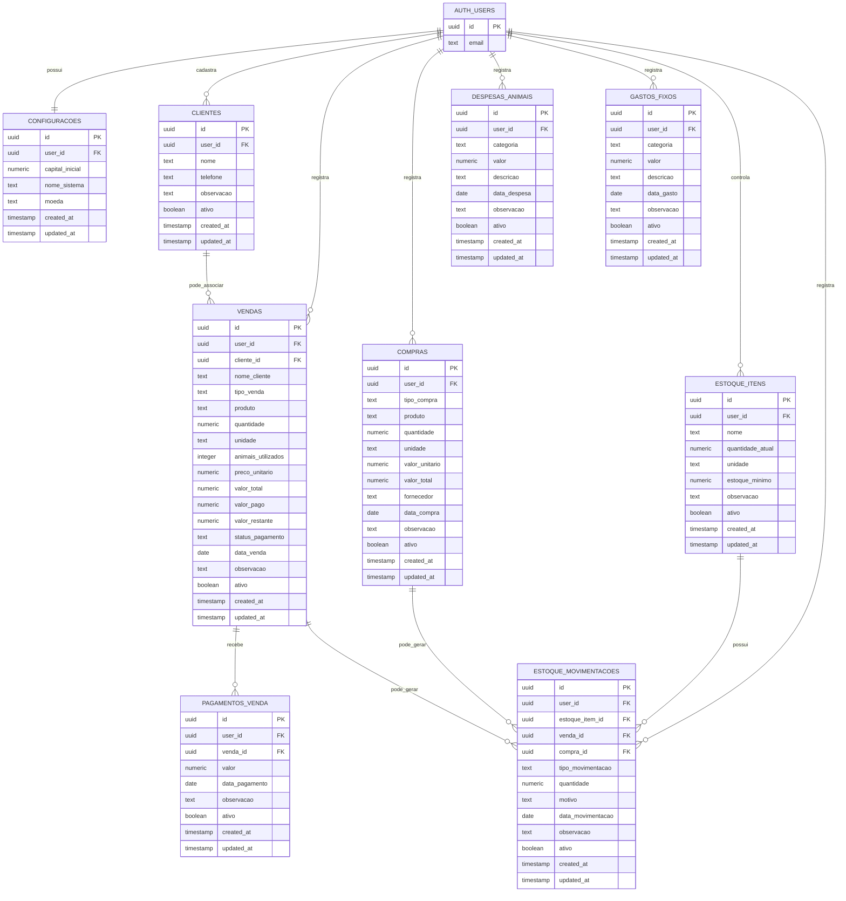

## Objetivo

Este DER representa o modelo de dados do sistema **Financial Pig**, um PWA mobile-first para controle financeiro, vendas, compras, estoque, consumo e relatórios de uma pequena atividade de criação e venda de porcos/carne, milho e ração.

O sistema utiliza **Supabase Auth** para autenticação e **PostgreSQL** para armazenamento dos dados.

O sistema possui **usuário único autenticado**, criado diretamente no Supabase.

---

# Diagrama ER em Mermaid



---

# Entidades

## AUTH_USERS

Representa o usuário autenticado pelo Supabase Auth.

Como o sistema possui usuário único, não haverá cadastro de usuários dentro do aplicativo.

Essa entidade representa a tabela interna de autenticação do Supabase.

---

## CONFIGURACOES

Armazena configurações gerais do sistema.

Exemplos:

- Capital inicial
    
- Nome do sistema
    
- Moeda utilizada
    

Relacionamento:

- Um usuário possui uma configuração principal.
    

---

## CLIENTES

Armazena clientes cadastrados opcionalmente.

O cadastro de cliente não é obrigatório para registrar vendas.

Uma venda pode ter:

- Cliente cadastrado;
    
- Apenas nome do cliente digitado manualmente;
    
- Nenhum cliente informado.
    

Campos principais:

- Nome
    
- Telefone
    
- Observação
    
- Ativo
    

---

## VENDAS

Armazena todas as vendas realizadas.

Tipos de venda:

- Porco/Carne
    
- Milho
    
- Ração
    
- Outros
    

Campos importantes:

- Tipo da venda
    
- Produto
    
- Quantidade
    
- Unidade
    
- Cliente cadastrado opcional
    
- Nome do cliente opcional
    
- Quantidade de animais utilizados
    
- Preço unitário
    
- Valor total
    
- Valor pago
    
- Valor restante
    
- Status do pagamento
    
- Data da venda
    

Regras importantes:

- O valor total é calculado automaticamente.
    
- O valor pago define o status da venda.
    
- O valor restante entra em contas a receber.
    
- Apenas o valor pago entra no saldo.
    
- Vendas de Porco/Carne podem reduzir o estoque de porcos.
    
- Vendas de Porco/Carne geram cálculo de média por cabeça.
    

---

## PAGAMENTOS_VENDA

Armazena pagamentos realizados posteriormente em vendas fiadas ou parciais.

Relacionamento:

- Uma venda pode possuir vários pagamentos.
    

Exemplo:

Uma venda de R$ 1.000,00 pode ter:

- Pagamento inicial de R$ 300,00;
    
- Pagamento posterior de R$ 200,00;
    
- Pagamento posterior de R$ 500,00.
    

Quando o valor restante chega a zero, a venda fica com status Pago.

---

## COMPRAS

Armazena compras realizadas para o negócio.

Tipos de compra:

- Compra de porcos/leitões
    
- Compra de milho
    
- Compra de ração
    
- Outros
    

Regras:

- Compra reduz o saldo.
    
- Compra de porcos aumenta estoque de porcos.
    
- Compra de milho aumenta estoque de milho.
    
- Compra de ração aumenta estoque de ração.
    

---

## DESPESAS_ANIMAIS

Armazena despesas diretamente relacionadas aos animais.

Categorias:

- Ração
    
- Milho para consumo dos animais
    
- Remédio
    
- Veterinário
    
- Transporte relacionado aos animais
    
- Funcionário/mão de obra
    
- Manutenção relacionada aos animais
    
- Outros
    

Regras:

- Reduz o saldo.
    
- Entra no cálculo do lucro.
    
- Fica separada dos gastos fixos/construção.
    

---

## GASTOS_FIXOS

Armazena gastos estruturais ou fixos.

Categorias:

- Construção
    
- Reforma
    
- Equipamentos
    
- Ferramentas
    
- Latas
    
- Baldes
    
- Canos
    
- Arames
    
- Madeiras
    
- Telhas
    
- Materiais diversos
    
- Outros
    

Regras:

- Reduz o saldo.
    
- Fica separado das despesas dos animais.
    
- Pode ser analisado separadamente no lucro operacional.
    

---

## ESTOQUE_ITENS

Armazena os itens controlados em estoque.

Itens principais:

- Porcos/leitões
    
- Milho
    
- Ração
    
- Outros
    

Campos principais:

- Nome
    
- Quantidade atual
    
- Unidade
    
- Estoque mínimo
    
- Observação
    

---

## ESTOQUE_MOVIMENTACOES

Armazena todas as alterações de estoque.

Tipos de movimentação:

- Entrada
    
- Saída
    
- Consumo
    
- Perda
    
- Ajuste
    

Regras:

- Entrada aumenta estoque.
    
- Saída reduz estoque.
    
- Consumo reduz estoque.
    
- Perda reduz estoque.
    
- Ajuste pode aumentar ou reduzir estoque.
    
- Estoque não pode ficar negativo.
    

Uma movimentação pode estar relacionada a:

- Uma venda;
    
- Uma compra;
    
- Um lançamento manual;
    
- Um consumo;
    
- Uma perda;
    
- Um ajuste.
    

---

# Relacionamentos principais

## Usuário e registros

O usuário autenticado é dono dos registros do sistema.

Todas as principais tabelas possuem `user_id`.

Isso permite aplicar regras de segurança no Supabase usando RLS.

---

## Cliente e vendas

Um cliente pode estar associado a várias vendas.

Porém, a associação é opcional.

Uma venda pode existir sem cliente cadastrado.

---

## Venda e pagamentos

Uma venda pode possuir vários pagamentos.

Isso permite controlar vendas parciais e fiadas.

---

## Venda e estoque

Uma venda pode gerar movimentações de estoque.

Exemplos:

- Venda de carne reduz estoque de porcos.
    
- Venda de milho reduz estoque de milho.
    
- Venda de ração reduz estoque de ração.
    

---

## Compra e estoque

Uma compra pode gerar movimentações de estoque.

Exemplos:

- Compra de leitões aumenta estoque de porcos.
    
- Compra de milho aumenta estoque de milho.
    
- Compra de ração aumenta estoque de ração.
    

---

## Estoque e movimentações

Um item de estoque pode possuir várias movimentações.

Exemplo:

O item "Milho" pode ter:

- Entrada por compra;
    
- Saída por venda;
    
- Consumo pelos animais;
    
- Perda;
    
- Ajuste manual.
    

---

# Observações sobre campos opcionais

## Em VENDAS

Os campos abaixo são opcionais:

```text
cliente_id
nome_cliente
observacao
animais_utilizados
```

Regras:

- `cliente_id` será preenchido apenas quando a venda for associada a um cliente cadastrado.
    
- `nome_cliente` pode ser usado quando o usuário quiser apenas digitar um nome simples.
    
- `animais_utilizados` será obrigatório apenas em vendas do tipo Porco/Carne.
    
- `observacao` pode ajudar em vendas fiadas sem cliente informado.
    

---

# Campos calculados

Alguns campos podem ser armazenados para facilitar consultas, mas devem ser calculados pelo sistema.

## Em VENDAS

```text
valor_total = quantidade × preco_unitario
```

```text
valor_restante = valor_total - valor_pago
```

```text
status_pagamento:
- Pago, se valor_pago = valor_total
- Parcial, se valor_pago > 0 e menor que valor_total
- Fiado, se valor_pago = 0
```

## Em vendas de Porco/Carne

```text
kg_medio_por_cabeca = quantidade ÷ animais_utilizados
```

```text
valor_medio_por_cabeca = valor_total ÷ animais_utilizados
```

Esses valores podem ser calculados em consulta ou exibidos na tela sem necessariamente serem armazenados.

---

# Indicadores derivados

Os relatórios e dashboard podem calcular:

```text
receita_total = soma(valor_total das vendas ativas)
```

```text
saldo_atual = capital_inicial + valores pagos recebidos - compras - despesas - gastos fixos
```

```text
contas_a_receber = soma(valor_restante das vendas fiadas/parciais ativas)
```

```text
media_geral_kg_por_cabeca = total_kg_vendidos ÷ total_animais_utilizados
```

```text
valor_medio_geral_por_cabeca = total_vendido_porco_carne ÷ total_animais_utilizados
```

```text
valor_medio_geral_por_kg = total_vendido_porco_carne ÷ total_kg_vendidos
```

---

# Soft delete

Nenhum registro deve ser excluído fisicamente do banco.

Ao invés de apagar, o sistema deve marcar:

```text
ativo = false
```

Registros inativos não aparecem nas listagens principais, mas podem aparecer em histórico ou relatórios específicos.

---

# Observação final

Este DER representa a estrutura inicial do sistema.

O modelo foi pensado para ser simples, mobile-first e adequado a um MVP, evitando excesso de tabelas e mantendo as regras principais:

- Controle de vendas;
    
- Controle de fiados;
    
- Controle de pagamentos;
    
- Controle de compras;
    
- Controle de estoque;
    
- Controle de consumo;
    
- Separação entre despesas dos animais e gastos fixos/construção;
    
- Cálculo de saldo real;
    
- Cálculo de médias das vendas de Porco/Carne.
